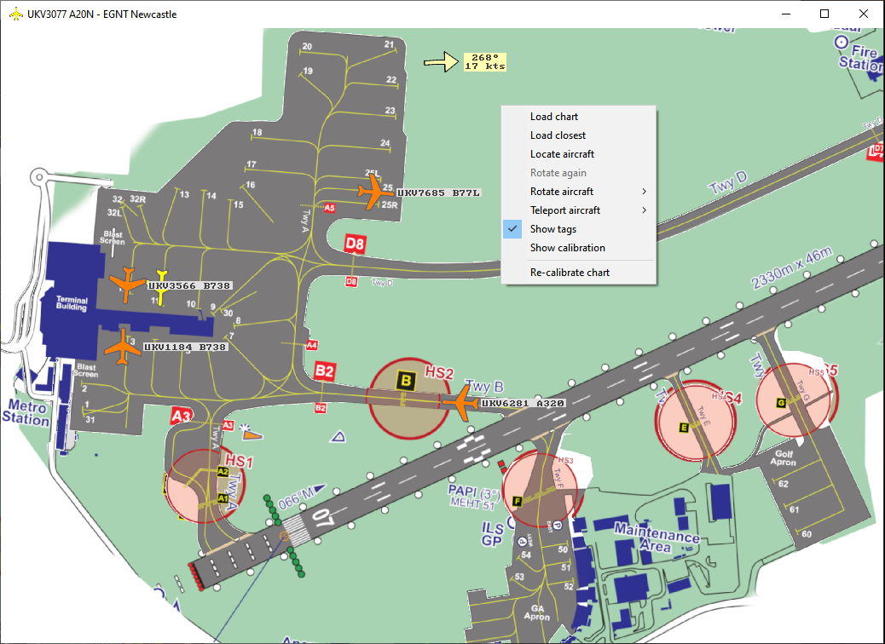

# FLIGHTSIM CHARTS

# Introduction

Overlay Microsoft Flight Simulator (FS2020) aircraft data onto real airport charts in real-time.

Ever been frustrated, especially when using VATSIM because you aren't sure which taxi way is which and you don't know where the correct stand is because FS2020 is using completely different stand numbers?

This program connects to FS2020 and allows you to load any Airport Chart (png or jpg format). The chart can be zoomed and panned and your aircraft location is shown in real time on the chart. It also shows other aircraft around you and they are tagged to show their callsign and aircraft model.

Charts for most airports can be downloaded from the internet and are most often in PDF format, containing multiple charts. After downloading a pdf you can load it into your favourite grahpics editing program, e.g. Gimp. When opening a pdf you have to choose the resolution you require and 300 pixels/inch seems to work well. Find the page that contains taxi way and parking information, rotate it so it is North up and then save it in .png or .jpg format.

# Quick Start

You can download the latest release as a zip file from here:

Link: [Latest release of FlightSim-Charts](https://github.com/scott-vincent/flightsim-charts/releases/latest/download/flightsim-charts-v1.0.4-Windows-x64.zip)

Open the zip file and drag the flightsim-charts folder onto your desktop (or anywhere you want on your PC). Open the folder on your desktop and run flightsim-charts.exe. The first time you run it you will get a warning saying "Windows protected your PC". To continue, you need to click "More info" and then "Run anyway". WIndows always gives this warning for downloaded files. I can assure you the file is safe as I've built it myself but you can always right-click it and virus scan it if you like.

The first time you run it it will ask you for a chart file. I've included a few with the zip that I've already calibrated but if you load your own you will have do a quick calibration the first time you load it. This involves selecting two points on the chart and the same two points in either Little Navmap (recommended) or OpenStreetMap. Choose two points that are well separated and diagonally opposite each other on the chart if possible.

Before clicking the desired calibration point on the chart you need to do the following:

In Little Navmap, browse to the airport you want and find exactly the same point, then right-click it and select More > Copy to clipboard.
If you don't have Little Navmap you can use your browser and go to https://www.openstreetmap.org/search?query=egll#map=14/51.4678/-0.4548 for example, right-click on the map and select 'Centre map here' then copy the contents of the browser's address bar into your clipboard (select, then Ctrl C).

Once your chart is calibrated just run FS2020. When you load into the airport your aircraft will appear on the chart.

This program must run on the same host as MS FS2020 and uses the Microsoft SimConnect SDK to connect to FS2020. It is very light on resources using less than 1% CPU and less than 1% GPU when tested on my own PC.

# Calibration Check

If you want to confirm your chart is calibrated correctly use the Show Calibration option on the right-click menu. This will show two red crosses at the two points you calibrated but it also allows you to check any other points on the chart.

Any point can be checked using Little Navmap. Right click on the point in Little Navmap and copy it to the clipboard (More > Copy location to clipboard). Now left click on the same point on the chart. As long as 'Show Calibration' is active a small red cross and a red circle will appear. If your calibration is correct the cross will be in the centre of the circle. If it is way out then consider re-calibrating the chart, maybe by choosing different points from the ones you chose before.  

# Command Window

When the program runs it creates a second window to show when it connects to FS2020. To hide this window, create a shortcut to flightsim-charts.exe and change its properties to Run: Minimised. Now when you run the program using the shortcut you will only see the chart window.

# Donate

If you find this project useful, would like to see it developed further or would just like to buy the author a beer, please consider a small donation.

